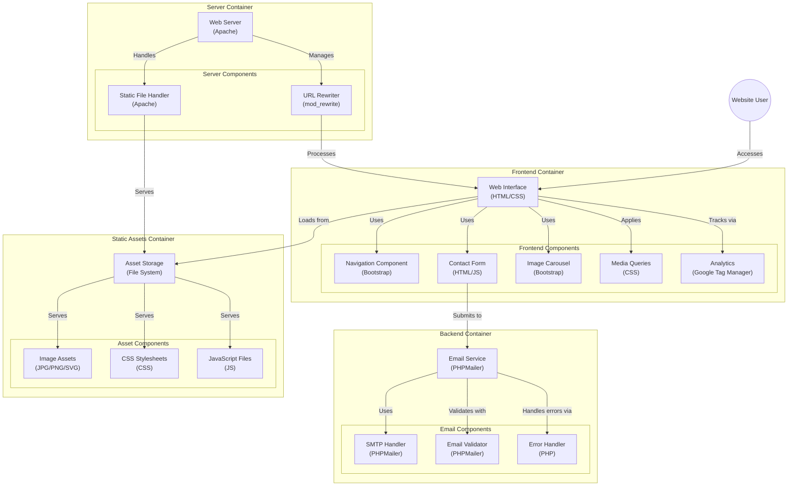

<h1>Allgarage</h1>

<strong>
Allgarage.cl es una página web creada para un taller mécanico ubicado en Av. Isabel Riquelme #2546 - Pedro Aguirre Cerda, Santiago de Chile.
</strong>
Este repositorio corresponde a la versión 2.0 del diseño. En el cual se modifican los wireframes las vistas, se mejoran títulos e información en general, se modifican algunas fotos y se agregan los nuevos servicios.
 

